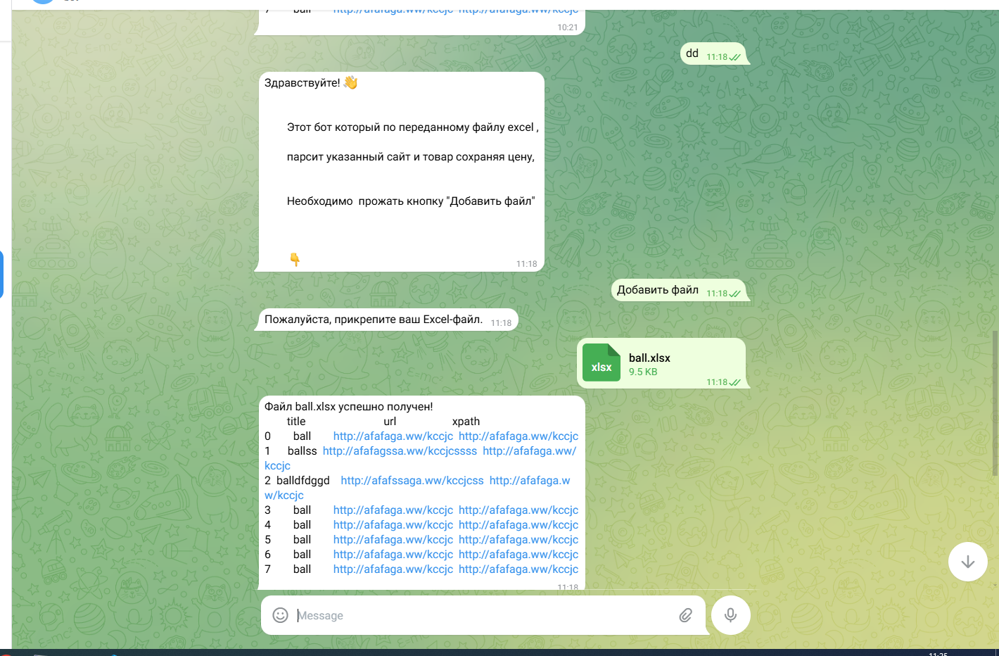
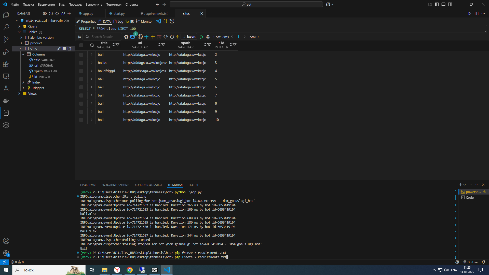
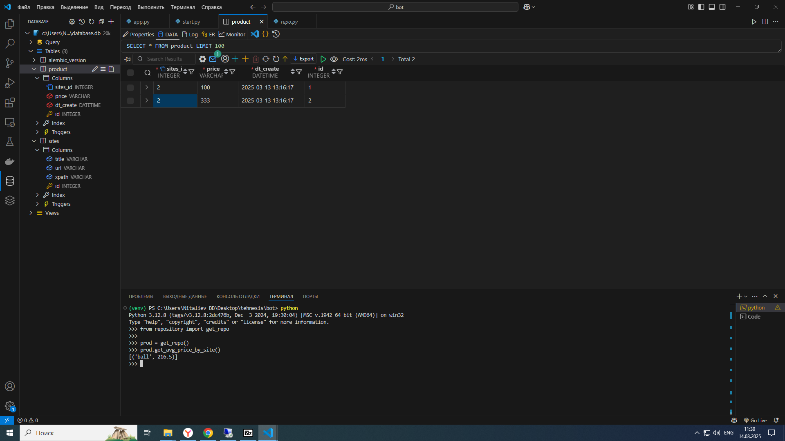

# Technesis task bot


## About <a name = "about"></a>

tg_bot

## Getting Started <a name = "getting_started"></a>

```git clone https://github.com/bulat-nitaliev/technesis_task_bot.git```


```cd technesis_task_bot```


### Installing

```python -m venv venv```

```активировать вертульное окружение и добавить зависимости ```

```pip install -r requirements.txt```

## Usage <a name = "usage"></a>

``python app.py``

## example
```работа бота```


```добавление тестовых данных ```



```получение среднего значения ```

